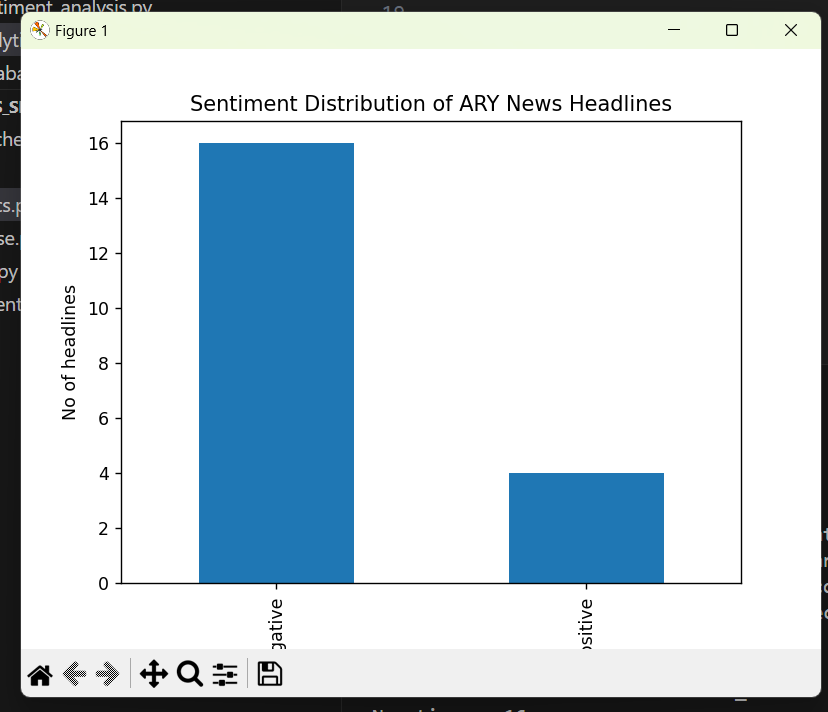

# ARY News Sentiment Analysis Pipeline

## Overview
This project builds a complete NLP pipeline:

1. Scrapes live headlines from ARY News
2. Stores data in MySQL
3. Performs sentiment analysis using VADER
4. Updates database with sentiment score
5. Visualizes sentiment distribution

## Tech Stack
- Python
- MySQL
- BeautifulSoup
- Pandas
- VADER
- Matplotlib

## Project Structure
- scraper.py → Scrapes headlines
- database.py → Manages MySQL
- sentiment_analysis.py → Performs NLP
- analytics.py → Generates visualization
- pipeline.py → Runs full workflow

## 📊 Sentiment Distribution



## How to Run

```bash
pip install -r requirements.txt
python pipeline.py


