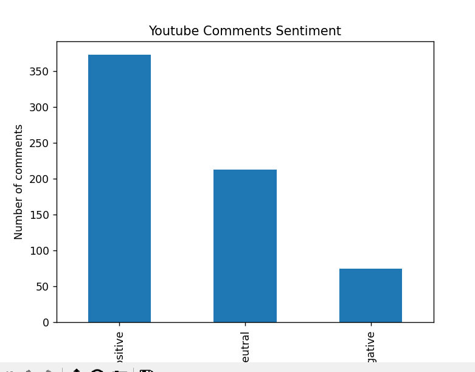

# YouTube Sentiment Analysis Pipeline

A complete end-to-end YouTube comment sentiment analysis system built using:

- YouTube Data API v3
- MySQL
- Python
- VADER Sentiment Analyzer
- Matplotlib

This project demonstrates real-world AI Engineering practices including:
- API integration
- Database design
- Data preprocessing
- Sentiment analysis
- Visualization
- Secure environment variable handling

---

## Project Architecture

Scrape → Store → Analyze → Visualize

1. Fetch comments from YouTube API
2. Store raw comments in MySQL
3. Preprocess comments
4. Perform sentiment analysis
5. Update database with sentiment results
6. Visualize sentiment distribution

---
## Example Output

- Positive / Negative / Neutral distribution bar chart
- Sentiment scores stored in database
---
## Sentiment Distribution

## 🧠 Tech Stack

- Python 3.10
- MySQL
- YouTube Data API
- vaderSentiment
- pandas
- matplotlib
- python-dotenv
- re

